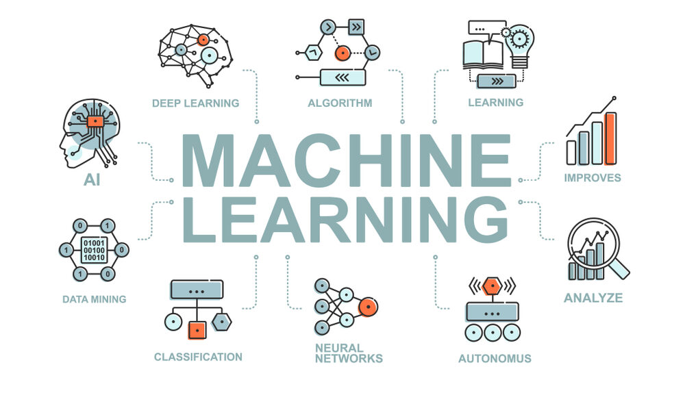

# Machine Learning Class Resources

## Classes Held

- [Class 1: held on September 17, 2022](./Introduction_to_ML.pdf)
- [Class 2: held on October 4, 2022](./Linear_and_Logistic_Regression)
- [Class 3: held on October 7, 2022](./KNN_and_Decision_Trees)
- [Class 4: held on October 11, 2022](./Ensemble_Learning)

## Machine Learning Resources

- [Machine Learning and Artificial Intelligence](https://drive.google.com/drive/folders/1zQk_yvuq-XI96EvxN7exS71O-ZeYnYOB?usp=sharing)
- [CS229 - Machine Learning by Andrew Ng (For deep understanding of ML)](https://youtube.com/playlist?list=PLoROMvodv4rMiGQp3WXShtMGgzqpfVfbU)
- [Machine Learning Tutorial](https://youtube.com/playlist?list=PLeo1K3hjS3uvCeTYTeyfe0-rN5r8zn9rw)
- [Kaggle Courses](https://www.kaggle.com/learn)
- [ML Blogs and Articles](https://towardsdatascience.com/machine-learning/home)

## Machine Learning Libraries/Frameworks Resources
- [Numpy](https://www.youtube.com/watch?v=Rbh1rieb3zc)
- [Pandas](https://www.youtube.com/playlist?list=PL-osiE80TeTsWmV9i9c58mdDCSskIFdDS)
- [Matplotlib](https://www.youtube.com/playlist?list=PL-osiE80TeTvipOqomVEeZ1HRrcEvtZB_)
- [scikit-learn](https://youtube.com/playlist?list=PL5-da3qGB5ICeMbQuqbbCOQWcS6OYBr5A)
- [OpenCV](https://youtube.com/playlist?list=PLS1QulWo1RIa7D1O6skqDQ-JZ1GGHKK-K)
- [TensorFlow 2.0](https://youtube.com/playlist?list=PLhhyoLH6IjfxVOdVC1P1L5z5azs0XjMsb)

## Python Language Guide 

- [Python Installaton Guide](https://www.youtube.com/watch?v=4Rx_JRkwAjY)
- [Jupyter Notebook Installation via Command Line](https://www.youtube.com/watch?v=TjRXT8mkTvM)
- [Jupyter Notebook Installation via Anaconda](https://www.geeksforgeeks.org/how-to-install-jupyter-notebook-in-windows/)
- [Python Playlist for ML(videos 1-70)](https://www.youtube.com/playlist?list=PLsyeobzWxl7poL9JTVyndKe62ieoN-MZ3)

## Some more resources for learning Python
- [Python Tutorial for Beginner (English)](https://youtube.com/playlist?list=PL-osiE80TeTskrapNbzXhwoFUiLCjGgY7)
- [Python Tutorial for Beginner (Hindi) - Till Video 76](https://youtube.com/playlist?list=PLu0W_9lII9agICnT8t4iYVSZ3eykIAOME)
- [Cheatsheet for Python and Data Science](./Python_and_Data_Science_CheetSheet.pdf)

## Contact Your Mentors
- [Anurag Gupta (7393011475)](https://teams.microsoft.com/l/chat/0/0?users=anurag.gupta@mnnit.ac.in)
- [Aayush Shandilya (6264465475)](https://teams.microsoft.com/l/chat/0/0?users=aayush.kumar@mnnit.ac.in)
- [Abhinav Anand (7061730046)](https://teams.microsoft.com/l/chat/0/0?users=abhinav.anand@mnnit.ac.in)