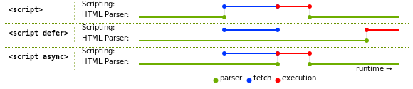
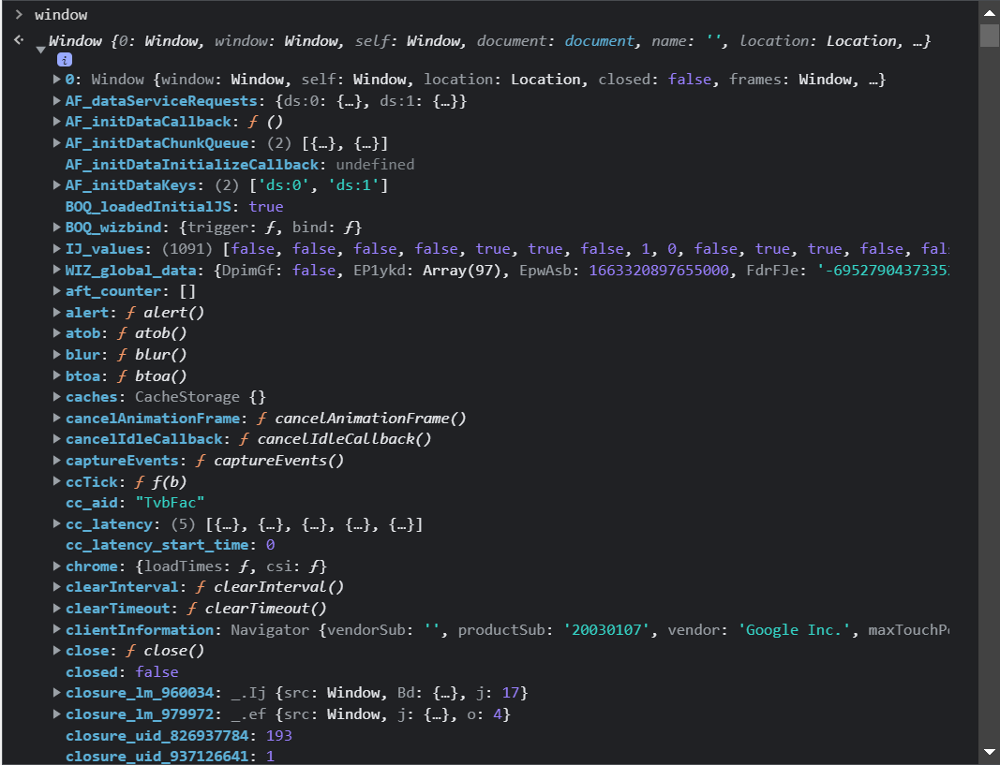
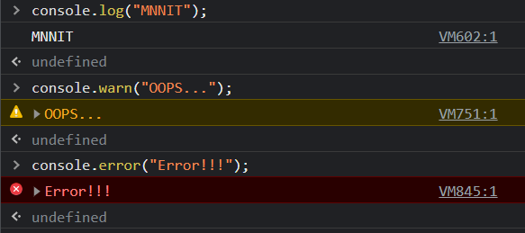
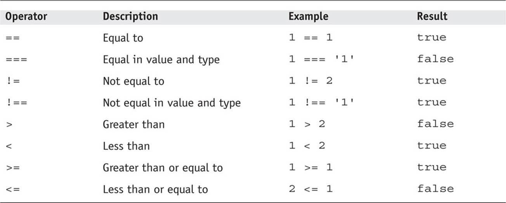

# Web Development Class - II

## Web Development Class - II PPT: [Here](./JAVASCRIPT%20BASIC.pdf)

### September 15, 2022

<hr>

<div align="center"><h2>JavaScript</h2></div>

<div align="center"></div>

*	### What is JS?
	* JavaScript is a **Scripting Language**, used to make web pages *dynamic* and *interactive*.
	* If HTML is the *BONES*, then JS is the *MUSCLES* of a webpage.

	<br>
*	### Scripting Language
	* Basically, all scripting languages are programming languages.
	* Scripting languages are interpreted e.g. JS, PHP, Python. Suitable for purposes where changes in code are more frequent.
	* Programming languages are compiled e.g. Java, C, C++. Suitable for purposes where changes in code are less frequent.
	* But Technically, Scripting languages are not fully interpreted theses days, they are compiled JIT(Just In Time).
	* JIT Compilation -> Byte Code(Intermediate-level Non-Runnable Code) -> Interpretor -> Machine Code(Binary) -> CPU Execution.
	* **Types** - Server-side scripting languages(JS, Python, PHP) and client-side scripting languages(JS).
	
	<br>
*   ### JS Engine
	* As per wiki:- "A Computer Program that executes JS code. The first JavaScript engines were mere interpreters, but all relevant modern engines use **just-in-time compilation** for improved performance."
	* **Example** - Google's V8 Engine (Used in Google Chrome, NodeJS runtime environment).

	<br>
*   ### Where to put JS inside HTML file?
	* Using **script** tag:
		```html
		<script>
			console.log("Hello World!");
		</script>
		```
	* Using **src** attribute of **script** tag:
		Put JavaScript code in a separate _**.js**_ file and include it inside html file.
		```html
		<script src="js_file.js"></script>
		```

	<br>
*   ### Async and Defer Boolean attributes of script tag.
	* **Without *async* or *defer*** -  
		* JavaScript files are fetched (downloaded) and executed in order of their presence in html file.
	* **With *defer*** - 
		* The file gets downloaded **asynchronously** along with HTML Parsing, but executed only when the document parsing is completed. 
		* They are executed in order of their presence in html file.
	* **With *async*** - 
		* The file gets downloaded asynchronously along with HTML Parsing but executed as soon as it’s downloaded. 
		* So, the order of execution is not fixed.

		<div align="center" style="background-color: white; margin: 1rem; padding-top: 1rem;" ></div>

	<br>
*   ### Window Object

	<div align="center"></div>

	*	Window object − Top of the hierarchy. It is the outmost element of the object hierarchy. Document object − Each HTML document that gets loaded into a window becomes a document object.

	*	Console - The console object provides access to the browser's debugging console. The console object can be accessed from any global object. It's exposed as Window.console, and can be referenced as console.

	<div align="center"></div>
	
	<br>
* ### Declaring a varible
    * **var**
		- The scope is **global** when a `var` variable is declared outside a function. This means that any variable that is declared with `var` outside a function block is available for use in the whole window.

			```jsx
			var tester = "hey hi";
			var hello = "outer-hello";
				
			function newFunction() {
				console.log(hello) // undefined
				var hello = "inner-hello";
				console.log(hello) // inner-hello
			}
			console.log(hello); // outer-hello
			```

		- `var` variables can be **re-declared** and **updated**

			```jsx
			var greeter = "hey hi";
			var greeter = "say Hello instead";
			greeter = "say Hello again";
			```

		- Problem with var

			```jsx
			var greeter = "hey hi";
			var times = 4;

			if (times > 3) {
				var greeter = "say Hello instead"; 
			}

			console.log(greeter) // "say Hello instead"
			```

			```jsx
			for(var i=0; i<5; i++) {
				console.log(i);  // 0 1 2 3 4
			}
			console.log(i) // 5
			```

		- So, since `times > 3` returns true, `greeter` is **redefined**  to `"say Hello instead"`. 
		- While this is not a problem if you knowingly want `greeter` to be redefined, it becomes a problem when you do not realize that a variable `greeter` has already been defined before.
		- If you have used `greeter` in other parts of your code, you might be surprised at the output you might get. This will likely cause a **lot of bugs** in your code. 
		- This is why `let` and `const` are necessary

	* **let** 

		- `let` is **block scoped**.

		- A block is a chunk of code **bounded by `{ }`** or simply anything within curly braces is a block.

			```jsx
			let greeting = "say Hi";
			let times = 4;

			if (times > 3) {
				let hello = "say Hello instead";
				console.log(hello); // "say Hello instead"
			}
			console.log(hello) // hello is not defined
			```

		- `let` can be updated but **not re-declared**.

			```jsx
			// this works fine:
			let greeting = "say Hi";
			greeting = "say Hello instead";
			```

			```jsx
			// this will return an error:
			let greeting = "say Hi";
			let greeting = "say Hello instead"; // error: Identifier 'greeting' has already been declared
			```

			```jsx
			let greeting = "say Hi";
				if (true) {
					let greeting = "say Hello instead";
					console.log(greeting); // "say Hello instead"
				}
				console.log(greeting); // "say Hi"
			```

	* **const**

		- Variables declared with the `const` **maintain constant values**. `const` declarations share some similarities with `let` declarations.

		- Like `let` declarations, `const` declarations are also **block scoped**, i.e they can only be accessed within the block they were declared.

		- `const` declarations **cannot be updated or re-declared**.

		- This means that the value of a variable declared with `const` remains the same within its scope.

			```jsx
			const greeting = "say Hi";
			greeting = "say Hello instead"; // error: Assignment to constant variable.
			```

*	### Scope in JS
	* Scope tell the visibility/accessibility of an entity(variable, function, object etc.)
	* **Global Scope** - 
		* Variables which can be accessed using window object. 
		* Entities (variables, functions, objects) defined in this scope can be accessed inside any block or fucntion of the script.
	* **Block Scope** - 
		* Statements written inside a set of {} makes a block. 
		* Variables defined using **let** and **const** are block scoped i.e. they are visible only inside the block where they are defined.
	* **Local Scope** - Variables defined inside a function are visible only inside the function i.e. they are local to that function.

	<br>
*   ### JS Primitive Data-types
	* number
	* boolean
	* string
	* undefined
	* null
	* bigInt
	* symbol

	<br>
*	### JS Dynamic Typing

	Dynamic typing :  JavaScript is a loosely typed and dynamic language. Variables in JavaScript are not directly associated with any particular value type, and any variable can be assigned (and re-assigned) values of all types:

	```jsx
		let foo = 42;  // foo is now a number
		foo = 'bar'; // foo is now a string
		foo = true;  // foo is now a boolean
	````

* ### **Template literal**
	Template literals provide an easy way to **interpolate** variables and expressions into strings.
		
	```jsx
		const fist_name = "Jon"
		const last_name = "Snow"
		const message1 = "Good Morning " + first_name + " " + last_name;
		// Same thing using Template Literal 
		const message2 = `Good Morning ${first_name} ${last_name}`
	```

*	### Functions in JS

	*	A JavaScript function is a block of code designed to perform a particular task.
	A JavaScript function is executed when "something" invokes it (calls it).

	*	You can reuse code: Define the code once, and use it many times.
	You can use the same code many times with different arguments, to produce different results.

	```jsx
	let x = square(4);   // Function is called, return value will end up in x

	function square(a) {
	return a * a;            // Function returns the product of a and b
	}
	```

*   ### JS Objects
	* An object is a collection of properties or key-value pairs. 
	* value can be a primitive value, an other object, a function etc.
	* **dot-notation** is used to access property of an object -  
	```javascript
	objectName.propertyName
	```
	* Unassigned properties of an object are *undefined*.
	* **for-in** loop can be used to access all key-value pairs of an object.

	<br>
*	### Array

	*	Arrays are a special type of objects. The typeof operator in JavaScript returns "object" for arrays.You can have variables of different types in the same Array.
	You can have objects in an Array. You can have functions in an Array. You can have arrays in an Array.

	```jsx
		const cars = ["Saab", "Volvo", "BMW"];

		const cars = [];
		cars[0]= "Saab";
		cars[1]= "Volvo";
		cars[2]= "BMW";

		const cars = new Array("Saab", "Volvo", "BMW");

		const foo = ['hello', 20, {f: "a", s: "b"}];
	```

	*	### Array Methods

		* **map**

			Map is not meant to be used like a loop. It is used to transform an array into another.

			```jsx
				const shoppingList = ["mango", "apple", "oranges"];

				// map applies a function to each value of array and returns a new array with updated values.
				const newShopingList = shoppingList.map(function(item) {
					return `new ${item}`;
				});
				console.log(newShopingList);
			```

		* **filter**

			If the callback function returns **true** or a value equivalent to **true**, the corresponding array element is appended to the **filteredArray.**

			```jsx
				const shoppingList = ["mango", "apple", "oranges"];

				const filterShoppingList = shoppingList.filter(function(item) {
					return (item !== "mango");
				});
				console.log(filterShoppingList);
			```
		
		* **reduce**

			The reduce() method executes a reducer function for array element. This method returns a single value: the function's accumulated result. Accumulated result at each step depends on the current element and the accumulated result at the previous step. The reduce() method does not change the original array.

			```jsx
				const numbers = [15.5, 2.3, 1.1, 4.7];

				let sum = numbers.reduce(getSum, 0);	//getSum - CallBack function, 0 - Initial Value

				function getSum(total, num) {
				return total + Math.round(num);
				}

				console.log(sum);	//24
			```

		* **forEach**

			The function **forEach()** is similar to the **map(),** but the difference is it does not return an array.

			```jsx
				const shoppingList = ["mango", "apple", "oranges"];

				shoppingList.forEach(function(item) {
					console.log(item)
				});
			```

		<div align="center"></div>

	<br>
*	### Loops

	```jsx
	const numbers = [45, 4, 9, 16, 25];
	```
	*	**for** - loops through a block of code a number of times.
		```jsx
		for (let i = 0; i < numbers.length; i++) {
		console.log(numbers[i]);
		}	
		```
	*	**for/in** - loops through the properties of an object.
		```jsx
		for (let x in numbers) {
		console.log(numbers[x]);
		}
		```
	*	**for/of** - loops through the values of an iterable object.
		```jsx
		for(let x of numbers){
			console.log(x);
		}
		```
	*	**while** - loops through a block of code while a specified condition is true.
		```jsx
		while( i < numbers.length){
			console.log(numbers[i]);
			i++;
		}
		```
	*	**do/while** - also loops through a block of code while a specified condition is true.
		```jsx
		do {
			console.log(numbers[i]);
		}
		while (i < numbers.length);
		```

* ### Destructuring

	* **Rest, Spread operators**

		```jsx
		const person = {
			first_name: "Jon",
			last_name: "Snow"
		}

		// object destructuring 
		const { first_name, last_name } = person;

		// object destructuring - This will give Error (undefined)
		const { a, b } = person;

		// object destructuring (changing name)
		const { first_name: new_first_name, last_name } = person;

		// Can You Relate? Destructuring is somewhat similar to "Tuple Unpacking" in Python.

		const a = [1, 2, 3]
		
		// Spread 'a'
		const b = [...a, 4, 5, 6]     // b = [1, 2, 3, 4, 5, 6]

		// Rest 'c'
		const [d, ...c] = b           // d = 1, c = [2, 3, 4, 5, 6]
		```

*	### Comparisons in JS
	*	``` == ``` - loose equality (double equals)
		will perform a type conversion when comparing two things, and will handle NaN, -0, and +0 specially to conform to IEEE 754 (so NaN != NaN, and -0 == +0);

	*	``` === ``` - strict equality (triple equals) will do the same comparison as double equals (including the special handling for NaN, -0, and +0) but without type conversion; if the types differ, false is returned.

	<div align="center" style="margin: 1rem;" ></div>

* ### 'this' keyword

	- The JavaScript `this` keyword refers to the **object it belongs to**. It has different values depending on where it is used.

	- Alone, this refers to the global object.

		```jsx
		console.log(this === global);   // true
		// global = window (client-side JS)
		// global = module.exports (node)
		```

	- In a function, `this` refers to the **owner** object.

		```jsx
		function foo() {
			console.log(this === global)
		}

		foo(); // owner of foo function is global

		const person = {
			firstName: "Harshit Gangwar",
			sayFullName: function () {
				console.log(this === person) // true
			},
		};

		person.sayFullName(); // owner of sayFullName functin is person object
		```

	- In a function, in [**strict mode**](https://www.w3schools.com/js/js_strict.asp), this is `undefined`.

		```jsx
		"use strict"; // Strict Mode
		function Hero(heroName, realName) {
			console.log(this); // undefined 
			this.realName = realName; // throws error 
			this.heroName = heroName;
		}
		const superman = Hero("Superman", "Clark Kent");
		console.log(superman);
		```

	- In a class, `this` refers to the **current class instance**.

		```jsx
		class Car {
			constructor() {
				this.brand = "Lexus";
				console.log(this); // Car { brand: "Lexus" }
				this.sayHello(); // Hello!
			}

			sayHello() {
				console.log("Hello!")
			}
		}

		const car = new Car();
		```

	- In an **event**, `this` refers to the **element that received the event**.

		```jsx
		<button onclick="this.style.display='none'">
			Click to Remove Me!
		</button>
		```

	- Methods like `call()`, and `apply()`, `bind()` can refer `this` to any object

		```jsx
		const person1 = {
			fullName: function() {
				return this.firstName + " " + this.lastName;
			}
		}
		const person2 = {
			firstName:"John",
			lastName: "Doe",
		}
		person1.fullName.call(person2);  // Will return "John Doe"
		```


*	### Document Object Model (DOM)
	* When a web page is loaded, the browser creates a Document Object Model of the page.
	* It is the webpage represented in terms of **tree of objects** for easy manipulation in JS code.

	<div align="center" style="margin: 1rem; background-color: white;" ></div>

	<br>
*	### Dom Manipulation/Query Selection
	
	* `document.getElementById('id_of_element')` => returns a single element
    * `document.getElementsByClassName('class_of_element')` => returns array like structure containing matching elements.
    * `document.getElementsByTagName('tag_of_element')` => returns array like structure containing matching elements.
    * `document.querySelector("#id-name")`, `querySelector(".class-name")`, `querySelector("ul")` => returns single matching element.
    * `document.querySelectorAll('#id-name')` => returns array like structure containing matching elements. 
    * `document.createElement('p')`; 
    * `element.appendChild('li')`;
    * `element.removeChild('li')`;

	<br>
*	### Events

	* When you browse the web, your browser registers different types of events. It's the browser's way of saying, "Hey, this just happened." Your script can then respond to these events.

	* Scripts often respond to these events by updating the content of the web page (via the Document Object Model) which makes the page feel more interactive.

	<br>
* ### Classes

	- The **constructor** is a special method that **initializes** an object created by a class automatically.
	
	- So each time we need to make a new User, we would have to pass in their username, age and address.

		```jsx
		class Rectangle {
			constructor(height, width) {
				this.height = height;  // property
				this.width = width;    // property
			}
		
			// method 
			getArea() {
				return this.width * this.height;
			}
		}
		```

	- Creating an instance -

		```jsx
		let rectangle = new Rectangle(5, 6);
		rectangle.getArea(); // 30
		```

	- Extending a class - 

		```jsx
		class Square extends Rectangle {
			constructor(length) {
				super(length, length);  // Calling constructor of parent class
			}
		}
		```
## Challenge
	Try to make a working calculator with simple functionality.