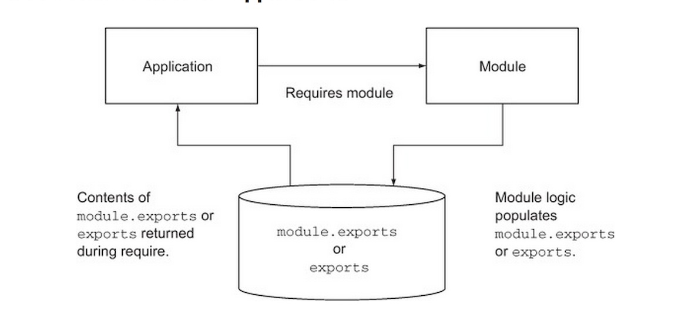
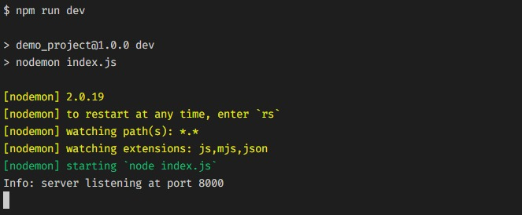

# Web Development Class - 4

## Web Development Class - Node I PPT : [Here](Node-1_Introduction%20To%20Node%20JS.pdf)

#### September 29, 2022

<h2>Introduction To Node JS</h2>

### What is Node?
* Node is JavaScript runtime environment that can run and execute JavaScript code.
* Originally, JavaScript was only meant to run on browser, thus node was introduced to extend the functionality of the language.
* It helps in creating highly scalable dynamic network applications.
* Some popular websites built using Node JS are - **LinkedIn**, **Microsoft**, **Netflix**, **PayPal**, **Walmart**, **IBM** etc.

### NPM (Node Package Manager)
* NPM is a free software store for JavaScript libraries.
* It also offers a package manager which offers installation of libraries.
* The [NPM registry](https://www.npmjs.com/) also contains description of packages and sample codes.
* "**npm init -y**" command is used to initialize a folder as an npm project.

### Module in Node
* Module is a group of functions which can be included in the application.
* It is used to promote code reusability in JS.
* Modules are of two types :-
  * **Core Modules / Built-in Modules** are the main functionalities which can be used without installation. Some of the frequently used modules are : http, url, path, fs, web etc.
  * **Local Modules / Custom Modules** are modules or functionalities created by developers. These are custom objects distributed in seperate files and folders.

### Setting up Node Project
* **Step 1** - Install Node environment (LTS version).
* **Step 2** - Run `node --version` or `node -v` in your command prompt or terminal to check whether Node is successfully installed or not.
* **Step 3** - Go to directory where you want to create the project.
* **Step 4** - Make a new folder named **Node_Project**.
* **Step 5** - Right Click in that directory and open command prompt or terminal.
* **Step 6** - Run "**npm init -y**" to initialize the folder as a npm project. This will create a **package.json** file into the project which acts as a configuration file for the npm project.
* **Step 7** - Run "**npm install**" to install the dependencies mentioned in the package.json file, if any.
* **Step 8** - Run "**npm run dev**" to start the server or the command mentioned as **dev** script in the package.json file.

### Material
* [Official Documentation](https://nodejs.org/en/docs/guides/)
* [Node JS Tutorial - W3 Schools](https://www.w3schools.com/nodejs/)
* [Node JS Dev](https://nodejs.dev/en/learn/)
* [Net Ninja Youtube Playlist](https://www.youtube.com/playlist?list=PL4cUxeGkcC9jsz4LDYc6kv3ymONOKxwBU)

### Home-Work Reading/Exploration Tasks

* Custom Modules
* Network Fundamentals
* HTTP Server using core **http module** in  node
* Node Frameworks, like Express etc. (to be covered in the next class)

